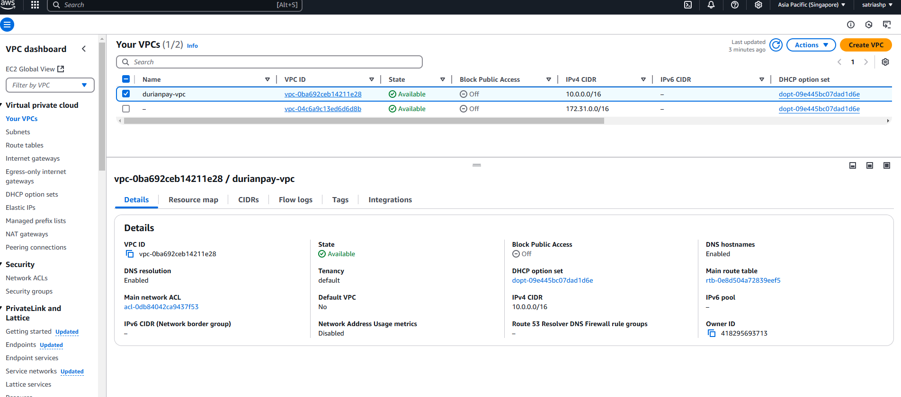
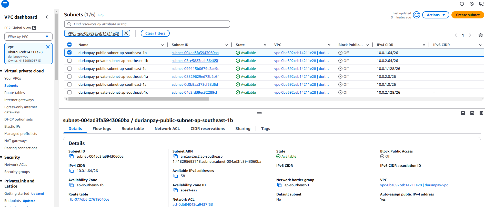
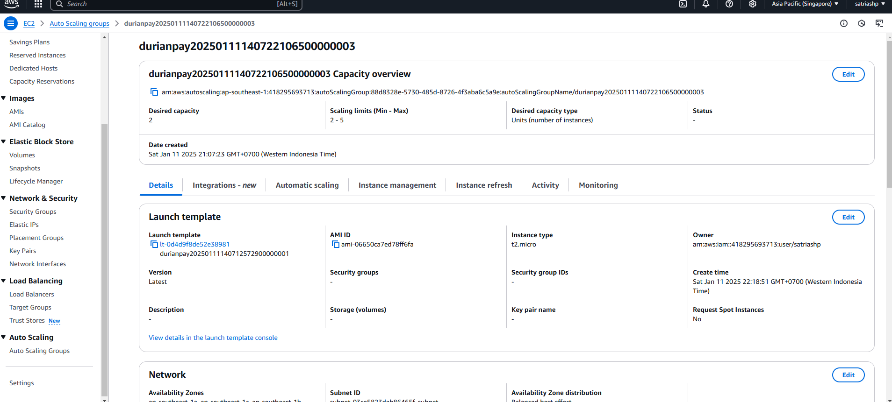
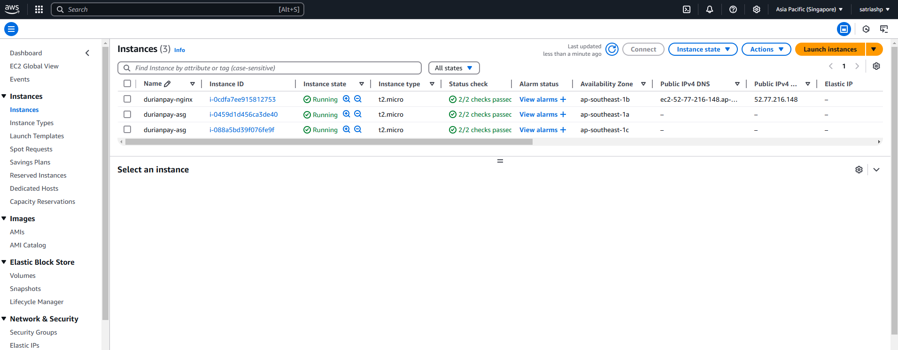

This repository contains:

# IAC
This folder includes Terraform manifests that provision AWS resources, wrapped with Terragrunt to ensure modularity, scalability, and easier management for multiple tenants or similar setups in the future.

The resources are deployed in the Singapore region (`ap-southeast-1`).

### Prerequisite

* awscli
* terragrunt (v0.72.0)
* terraform (v1.10.4)

## Quick Overview (Screenshot)
#### VPC

#### Subnet

#### Auto Scaling Group

#### EC2 Instance

#### Cloudwatch Alarm

## Notes
* Due to AWS Free Tier limitations, the EC2 instance is provisioned as `t2.micro` instead of `t3.medium`.
* You may perform a quick check via awscli. (AWS Access Key and Secret will be sent via email).

# App
This folder contains a demo app using the `nginx:alpine` Docker image to serve a hello.txt file. It is deployed to an AWS EC2 instance using the GitHub Actions pipeline defined in [`.github/workflows/pipeline.yaml`](.github/workflows/pipeline.yaml).

### Steps
1. Checkout code
2. Setup docker buildx and Login to `dockerhub`
3. Build and push docker image name: `satriashp/durianpay:latest`
4. Setup ssh key and access AWS ec2 instance
5. Pull the latest `satriashp/durianpay` docker image then restart current running container.

## Notes
* Demo app can be access via this [link](http://52.77.216.148/)
