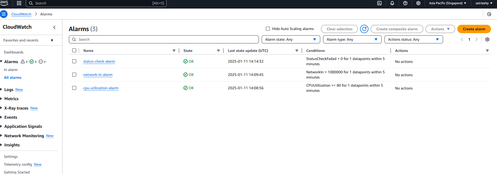

This repo contains

# IAC
This folder are contain terraform manifest that provision AWS resource warp with terragrunt to help modular and future proof and easy manage for multiple tenant or similar setup in future.

Resource are deploy on region Singapore `ap-southeast-1`

### Prerequisite

* awscli
* terragrunt (v0.72.0)
* terraform (v1.10.4)

## Quick Overview (Screenshot)
#### VPC

#### Subnet

#### Auto Scaling Group

#### EC2 Instance

#### Cloudwatch Alarm

## Notes
* Cause the limitation of AWS Free Tier, EC2 instance are provision with `t2.micro` instead of `t3.medium`
* Feel free to do quick check via awscli. (AWS Acces Key and Secret will sent via email)

# App
This folder are contain demo app with nginx:alpine docker that serve hello.txt file. Also deployed to aws ec2 instance using Github Action `./github/workflows/pipeline.yaml`

### Steps
1. Checkout code
2. Setup docker buildx and Login to `dockerhub`
3. Build and push docker image name: `satriashp/durianpay:latest`
4. Setup ssh key and access AWS ec2 instance
5. Pull latest `satriashp/durianpay` docker image then restart current running container.
